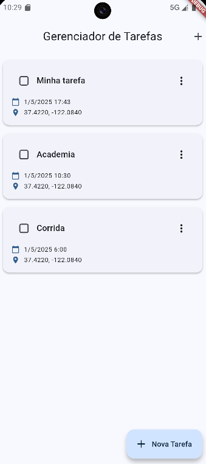
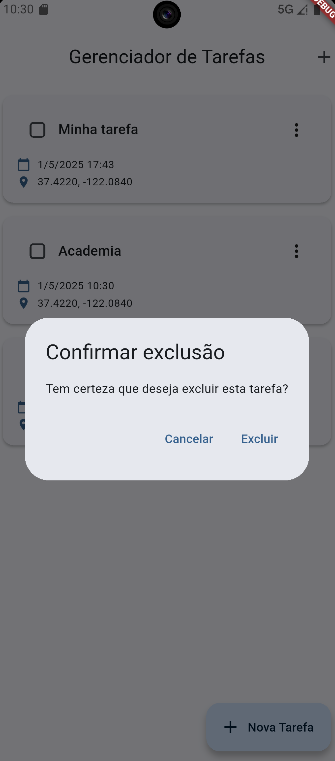
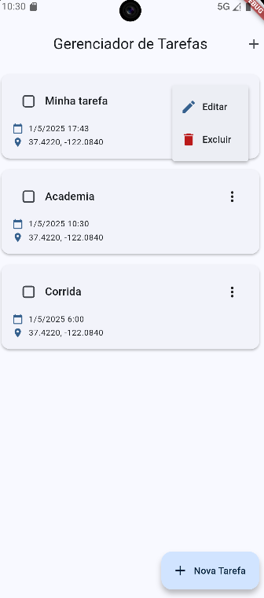

# Gerenciador de Tarefas Flutter

Um aplicativo de gerenciamento de tarefas completo desenvolvido em Flutter, responsivo e utilizando Firebase.



## Funcionalidades

- ✅ Adicionar novas tarefas com título, data e hora
- ✅ Visualizar lista de tarefas
- ✅ Editar tarefas existentes
- ✅ Excluir tarefas com confirmação
- ✅ Marcar tarefas como concluídas
- ✅ Persistência de dados local e Firestore Database
- ✅ Interface responsiva para diferentes tamanhos de tela

## Tecnologias Utilizadas

- **Flutter**: Framework UI multiplataforma
- **Provider**: Gerenciamento de estado
- **SharedPreferences**: Persistência de dados local para plataformas móveis
- **Firebase**: Persistência de dados e autenticação
- **APIs**: Uso de APIs externas públicas para obter mapa, nome de endereços etc.

## Arquitetura

O projeto segue uma arquitetura em camadas com clara separação de responsabilidades:

- **UI Layer**: Interfaces de usuário e componentes visuais
- **Business Logic Layer**: Serviços e lógica de negócios
- **Data Layer**: Repositórios e persistência de dados

Para mais detalhes sobre a arquitetura, consulte o arquivo [arquitetura_projeto.md](arquitetura_projeto.md).

## Estrutura de Diretórios

```
lib/
├── components/           # Componentes reutilizáveis da UI
├── models/               # Definição de modelos de dados
├── pages/                # Telas do aplicativo
├── repositories/         # Camada de acesso a dados
├── routes/               # Gerenciamento de rotas
├── services/             # Serviços e lógica de negócios
├── theme/                # Configuração de temas
├── utils/                # Utilitários e helpers
└── main.dart             # Ponto de entrada do aplicativo
```

## Como Executar

### Pré-requisitos

- Flutter SDK (versão 3.0.0 ou superior)
- Dart SDK (versão 2.17.0 ou superior)
- Editor (VS Code, Android Studio, etc.)

### Passos para Executar

1. Clone o repositório:
   ```bash
   git clone https://github.com/seu-usuario/gerenciador-tarefas-flutter.git
   cd gerenciador-tarefas-flutter
   ```

2. Instale as dependências:
   ```bash
   flutter pub get
   ```

3. Execute o aplicativo:
   ```bash
   # Para dispositivos móveis
   flutter run
   
   # Para web
   flutter run -d chrome
   ```

## Screenshots

| Lista de Tarefas | Formulário de Tarefa |
|:---------------:|:------------------:|
|  |  |

| Confirmação de Exclusão | Editar/Excluir |
|:----------------------:|:-------------:|
|  |  |

## Análise do Projeto

Para uma análise detalhada do projeto, incluindo pontos fortes, problemas identificados e recomendações para melhorias futuras, consulte o arquivo [analise_projeto_flutter.md](analise_projeto_flutter.md).

## Licença

Este projeto está licenciado sob a licença MIT - veja o arquivo [LICENSE](LICENSE) para detalhes.
